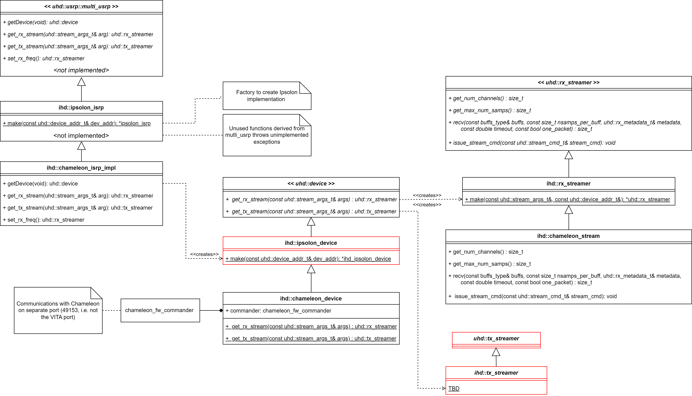

# The purpose of this project is to provide a UHD like implementation of Ipsolon SDR products

The goal is minimize the number of changes necessary for a UHD user to implement an Ipsolon SDR.

USRP - Universal Software Radio Protocol
UHD - USRP Hardware Driver

ISRP - Ipsolon Software Radio Protocol
IHD - ISRP Hardware Driver

## Example UHD Implementation

Below is an example take from UHD rx_samples_to_file.cpp:
``` C++
 // create a usrp device
uhd::usrp::multi_usrp::sptr usrp = uhd::usrp::multi_usrp::make(args);
...
// set the sample rate
usrp->set_rx_rate(rate, channel);

// set the center frequency

uhd::tune_request_t tune_request(freq, lo_offset);
if (vm.count("int-n")) {
    tune_request.args = uhd::device_addr_t("mode_n=integer");
}
usrp->set_rx_freq(tune_request, channel);
uhd::stream_args_t stream_args(cpu_format, wire_format);
std::vector<size_t> channel_nums;
channel_nums.push_back(channel);
stream_args.channels             = channel_nums;
uhd::rx_streamer::sptr rx_stream = usrp->get_rx_stream(stream_args);

uhd::rx_metadata_t md;
std::vector<samp_type> buff(samps_per_buff);

// setup streaming
uhd::stream_cmd_t stream_cmd((num_requested_samples == 0)
                                 ? uhd::stream_cmd_t::STREAM_MODE_START_CONTINUOUS
                                 : uhd::stream_cmd_t::STREAM_MODE_NUM_SAMPS_AND_DONE);
stream_cmd.num_samps  = size_t(num_requested_samples);
stream_cmd.stream_now = true;
stream_cmd.time_spec  = uhd::time_spec_t();
rx_stream->issue_stream_cmd(stream_cmd);
...
while (not stop_signal_called
       and (num_requested_samples != num_total_samps or num_requested_samples == 0)
       and (time_requested == 0.0 or std::chrono::steady_clock::now() <= stop_time)) {
         size_t num_rx_samps = rx_stream->recv(&buff.front(), buff.size(), md, 3.0, enable_size_map);
         /* --- Process Samples --- */
```
## Example IHD implmentation

To replace the UHD implementaion, simply replace `multi_usrp` with `ipsolon_isrp` 

``` C++
 // create a isrp device
ihd::ipsolon_isrp::sptr isrp = ihd::ipsolon_isrp::make(args);

/*** Once the Ipsolon device is created, it is used exactly the same as the usrp device */
...
// set the sample rate
->set_rx_rate(rate, channel);

// set the center frequency

uhd::tune_request_t tune_request(freq, lo_offset);
if (vm.count("int-n")) {
    tune_request.args = uhd::device_addr_t("mode_n=integer");
}
set_rx_freq(tune_request, channel);
uhd::stream_args_t stream_args(cpu_format, wire_format);
std::vector<size_t> channel_nums;
channel_nums.push_back(channel);
stream_args.channels             = channel_nums;
uhd::rx_streamer::sptr rx_stream = ->get_rx_stream(stream_args);

uhd::rx_metadata_t md;
std::vector<samp_type> buff(samps_per_buff);

// setup streaming
uhd::stream_cmd_t stream_cmd((num_requested_samples == 0)
                                 ? uhd::stream_cmd_t::STREAM_MODE_START_CONTINUOUS
                                 : uhd::stream_cmd_t::STREAM_MODE_NUM_SAMPS_AND_DONE);
stream_cmd.num_samps  = size_t(num_requested_samples);
stream_cmd.stream_now = true;
stream_cmd.time_spec  = uhd::time_spec_t();
rx_stream->issue_stream_cmd(stream_cmd);

while (not stop_signal_called
       and (num_requested_samples != num_total_samps or num_requested_samples == 0)
       and (time_requested == 0.0 or std::chrono::steady_clock::now() <= stop_time)) {
         size_t num_rx_samps = rx_stream->recv(&buff.front(), buff.size(), md, 3.0, enable_size_map);
        /* --- Process Samples --- */
```

## UML Diagram



## Docker container with the release version of GNU Radio in the latest stable Ubuntu

The Dockerfile is used to be able to manage versions and compatibility issues of the gnuradio and uhd utilities. The resulting container has the GUI available (so you may use the gnuradio companion and QT widgets) as well as audio. Several packages needed to compile and test are also installed and configured. 

If you want the release version of GNU Radio (currently 3.10): 

1. Install docker by following [Docker's installation guide](https://docs.docker.com/get-docker/) (though I've tested this on Ubuntu only, so for convenience a direct link to the corresponding [guide for Ubuntu](https://docs.docker.com/engine/install/ubuntu/#install-using-the-repository)). 
2. Clone this repo.
3. Enter the `docker/uhd-gnuradio-latest` folder and execute `./docker_build.sh` (this step is necessary only once, or every time you modify *Dockerfile*) 
4. Run the container: `./docker_run.sh`

You will then be in a command line logged as user *titan* who is a sudoer (password: *titan*). The *ihd* folder in this project will be mounted inside the docker container and will persist after you exit the container.  **Remember**: everything else is erased after you exit the container. This means for instance that if you compile and install you will have to do that again every time you run the container (unless for instance you compile in the *ihd* folder). You may modify *run_docker.sh* script to avoid this by adding other mount points. 

The host's USB/ethernet should be accessible from the docker too, meaning you should be able to use any SDR hardware you plug into the PC.
